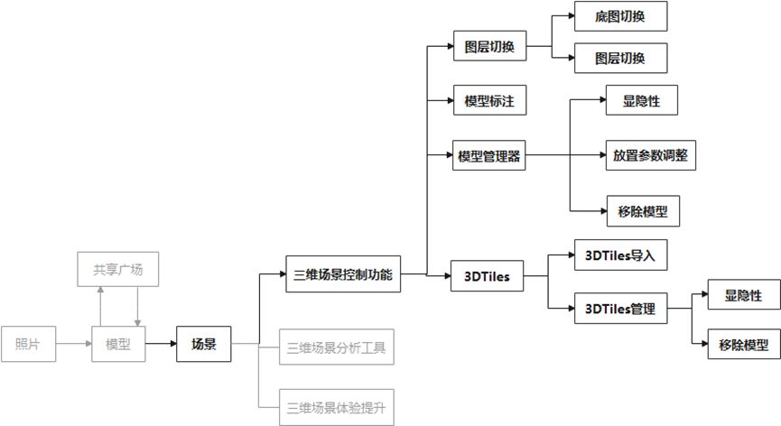
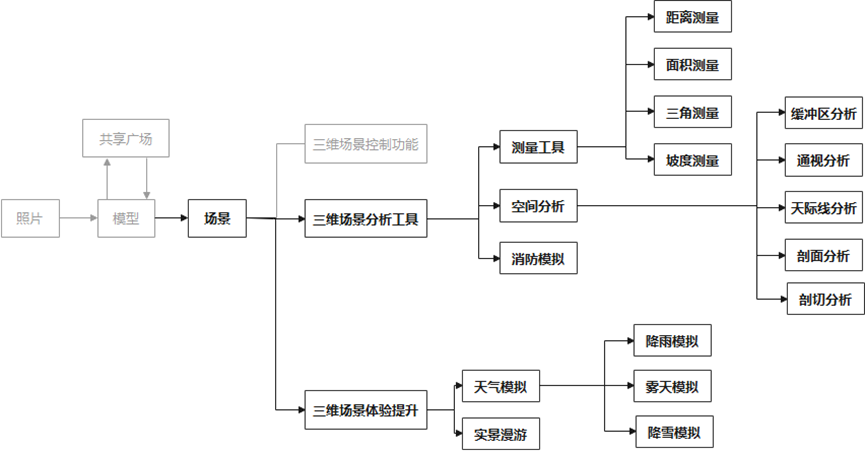

# OpenWorld demo

## 说明
参赛项目的前端，大部分功能基于原生Cesium开发。
## 功能介绍

具体实现参看对应命名的JS文件
## 开发日志（？）
### 实现的功能

1. 界面重写
2. 将三维重建结果的.ply 文件转为了**OBJ（带材质）、GLTF**和 3DTiles
3. 在页面中使用 ThreeJS 渲染 OBJ，并添加了控制器，可以使用鼠标旋转/缩放
4. 将转出的 GLTF 加入地图中，并实现对 GLTF 的调整（平移、旋转和缩放）；实现加入地图中的 GLTF 模型的管理（显隐性、调整参数编辑和删除）
5. （7.29）新增了模拟雨雪雾功能
6. （7.30）新增了模型标注以及单击时条件查找功能
   _由于使用了新版本的 layui，可能导致前面某些样式发生改变……目前没发现影响特别大的，有再改_
7. （7.31）在初始化场景时就将放置好的模型添加到地图上，并可以进行修改/删除（模型的放置状态保存在后端）
8. （8.01）用户可自行上传 3DTiles（一次性，不在后端保存）并管理（可视性/移除图层）
9. （8.03）新增了缓冲区分析（内含交互绘制）功能，还想补一个统计
10. （8.04）优化了菜单栏动画以及缓冲区分析中的交互绘制。缓冲区后的统计做了一半，感觉效果较差，暂弃用（相关文件后缀：-useless）；前端新增了缓冲区分析后，获得缓冲区范围内的模型点功能，但该功能暂时还未直接用上；后端添加了按 id 查找的接口。
11. （8.06）添加了对所有数据的统计分析；优化了缓冲分析后的结果显示（添加动态圆效果）；视域分析开了个头。后端获取 access_token 的方法换为稳定版
12. （8.07）添加了通视分析功能，沉浸漫游功能开了个头；视域分析先放着
13. （8.08）沉浸漫游差视角跟踪。
14. （8.09）参考了大佬代码，沉浸漫游结束~

### 环境配置

#### 后端（demo-server）

1. MVG+MVS 路径配置：app.py 第 86、87 行
   

2. obj23dtiles 工具安装
   见链接：[obj23dtiles README](https://princessgod.github.io/objTo3d-tiles/README_CN.html)

3. 将 demo-server 下的 static 文件夹发布到 IIS（端口号 8180）
   
   发布完成后，找到**MIME 类型**，点进去。
   

右侧点击**添加**，分别添加文件拓展名**.obj/.mtl/.gltf**的 MIME 类型为**text/html**。（没记错的话应该就这几个

